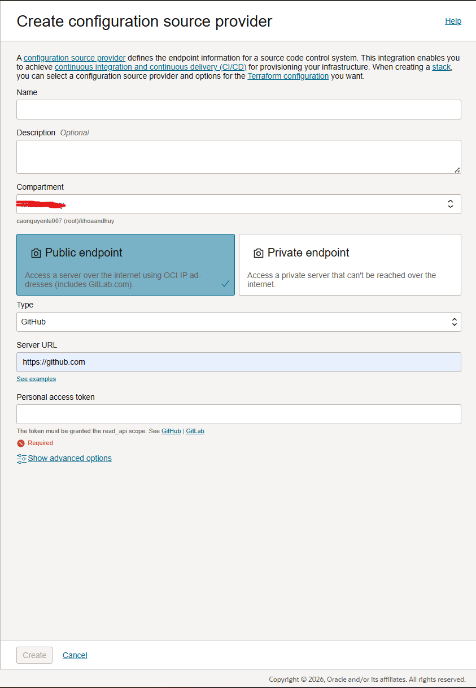

# OCI Terraform using Resource Manager

## Key Concepts
- **Configuration**: *Information to codify your infrastructure. Use your configuration to specify the Oracle Cloud Infrastructure resources in a given stack.*
- **Source Provider**: *Connection information to a source code control system where your Terraform configuration files are stored. Use a configuration source provider to create a stack from a remote, versioned Terraform configuration file.*
- **Drift**: *Difference between the actual, real-world state of your infrastructure, and the stack's last executed configuration.*
- **Job**: *Instructions to perform the actions defined in your configuration. Only one job at a time can run on a given stack; further, you can have only one set of Oracle Cloud Infrastructure resources on a given stack. To provision a different set of resources, you must create a separate stack and use a different configuration.*
- **Stack**: *The collection of Oracle Cloud Infrastructure resources corresponding to a given Terraform configuration. Each stack resides in the compartment you specify, in a single region; however, resources on a given stack can be deployed across multiple regions. An OCID is assigned to each stack.*

## Require
- Terraform repository for Stack
- OCI account (admin role required)

## Guideline
### Configuration source providers
#### Docs
-  https://docs.oracle.com/en-us/iaas/Content/ResourceManager/Concepts/terraformconfigresourcemanager.htm
- https://docs.oracle.com/en-us/iaas/Content/ResourceManager/Concepts/resourcemanager.htm#concepts__stackdefinition
#### Steps
1. Set the source providers name
2. Add the description (optional)
3. Choose compartment to manage source provider
4. Choose Access Type: 
- Public for Repo accessible for Internet
- Private for repo hosted privately
5. Choose source repo type (GitHub) and provide authen configuration

### Create Stacks
1. Choose source provider set up before

2. Set Stack name, Add the description (optional), Choose compartment to manage the stack.

3. Set up varibales for the stack

4. Review and create

### Use created Stack to provision resources
1. Choose the Stack created above.
2. Choose the actions to run.
- Plan: Review the resource changes before apply.
- Apply: apply the changes to current resource state.
- Destroy: destroy the resources.

