# OCI Infrastructure as Code with Terraform & GitHub Actions

Automated deployment of Oracle Cloud Infrastructure (OCI) resources using Terraform and GitHub Actions CI/CD pipelines.
## 🏗️ Architecture Overview

### Infrastructure Deployment Flow

```mermaid
flowchart LR
    subgraph Developer["👨‍💻 Developer"]
        Code[Edit .tf files]
        Commit[Git Commit/Push]
    end

    subgraph GitHub["⚙️ GitHub Actions"]
        Validate[terraform validate]
        Plan[terraform plan]
        Apply[terraform apply]
    end

    subgraph OCI["☁️ Oracle Cloud"]
        VCN[VCN]
        Subnet[Subnets]
        NSG[NSGs]
        GW[Gateways]
    end

    Code --> Commit
    Commit --> Validate
    Validate --> Plan
    Plan --> Apply
    Apply --> VCN
    VCN --> Subnet
    VCN --> NSG
    VCN --> GW
```



### Module Dependencies


### CI/CD Pipeline


### Environment Isolation

```mermaid
flowchart TB
    subgraph Repo["📂 Repository"]
        TF[Terraform Code]
    end

    subgraph Dev["🌱 Development"]
        DevState[(dev/terraform.tfstate)]
        DevVCN[dev-myapp-vcn-0]
        DevSubnet[dev-myapp-subnet-*]
    end

    subgraph Prod["🏭 Production"]
        ProdState[(prod/terraform.tfstate)]
        ProdVCN[prod-myapp-vcn-0]
        ProdSubnet[prod-myapp-subnet-*]
    end

    TF -->|dev.tfvars| Dev
    TF -->|prod.tfvars| Prod
    DevState --> DevVCN --> DevSubnet
    ProdState --> ProdVCN --> ProdSubnet
```



---
## � Table of Contents
- [Architecture Overview](#️-architecture-overview)- [Quick Start](#-quick-start)
- [Repository Structure](#-repository-structure)
- [Multi-Environment Deployment](#-multi-environment-deployment)
- [Local Development](#-local-development)
- [Testing](#-testing)
- [Linting](#-linting)
- [Modules](#-modules)
- [Runbook](#-runbook)
  - [RB-01: Initial Project Setup](#-rb-01-initial-project-setup)
  - [RB-02: Deploy to Development](#-rb-02-deploy-to-development-environment)
  - [RB-03: Deploy to Production](#-rb-03-deploy-to-production-environment)
  - [RB-04: Add a New Subnet](#-rb-04-add-a-new-subnet)
  - [RB-05: Add a New NSG Rule](#-rb-05-add-a-new-nsg-rule)
  - [RB-06: Import Existing Resource](#-rb-06-import-existing-oci-resource)
  - [RB-07: Rollback a Deployment](#-rb-07-rollback-a-deployment)
  - [RB-08: Destroy Environment](#-rb-08-destroy-environment)
  - [RB-09: Debug Terraform Issues](#-rb-09-debug-terraform-issues)
  - [RB-10: View Infrastructure State](#-rb-10-view-current-infrastructure-state)
  - [RB-11: Upgrade Provider](#-rb-11-upgrade-terraform-provider)
  - [RB-12: Rotate API Keys](#-rb-12-rotate-oci-api-keys)
- [Troubleshooting](#-troubleshooting)
- [Configuration](#-configuration)
- [Resources](#-resources)

---

## �📋 Quick Start

### 1. Prerequisites

- Terraform >= 1.7
- OCI CLI v2
- OCI account with API credentials
- GitHub repository access
- TFLint (optional, for linting)

### 2. OCI Setup

```bash
# Generate OCI API Key
mkdir -p ~/.oci
openssl genrsa -out ~/.oci/oci_api_key.pem 2048
openssl rsa -pubout -in ~/.oci/oci_api_key.pem -out ~/.oci/oci_api_key_public.pem

# Get fingerprint
openssl rsa -pubout -outform DER -in ~/.oci/oci_api_key.pem | openssl md5 -hex

# Upload public key to OCI Console: Profile → API Keys
```

### 3. Configure GitHub Secrets

Add to repository Settings → Secrets and variables → Actions:

```
OCI_TENANCY_OCID              # Your tenancy OCID
OCI_USER_OCID                 # Your user OCID
OCI_FINGERPRINT               # API key fingerprint
OCI_API_KEY_PRIVATE           # Base64 encoded private key
OCI_REGION                    # Region (e.g., ap-singapore-1)
OCI_COMPARTMENT_OCID          # Compartment OCID
```

**Encode private key:**
```bash
base64 -w 0 ~/.oci/oci_api_key.pem | pbcopy  # macOS
base64 -w 0 ~/.oci/oci_api_key.pem | xclip   # Linux
certutil -encode oci_api_key.pem oci_api_key.b64  # Windows
```

## 📁 Repository Structure

```
.
├── .github/
│   ├── workflows/
│   │   ├── terraform-validate.yml  # Syntax & format checks
│   │   ├── terraform-plan.yml      # Plan & PR comments
│   │   ├── terraform-apply.yml     # Deploy changes
│   │   └── terraform-destroy.yml   # Manual resource cleanup
│   └── skills/                     # GitHub Copilot custom instructions
│       ├── terraform-style-guide/  # Terraform coding standards
│       └── terraform-test/         # Testing best practices
├── modules/
│   ├── apigateway/                 # API Gateway configuration
│   ├── artifact/                   # Artifact Registry
│   ├── bastion/                    # Bastion host
│   ├── container/                  # OKE cluster
│   ├── database/                   # Database services
│   ├── filestorage/                # File Storage
│   ├── logging/                    # Logging setup
│   ├── manifest/                   # Kubernetes manifests
│   ├── networking/                 # VCN, subnets, NSGs
│   ├── objstorage/                 # Object Storage
│   ├── privateendpoint/            # Private endpoints
│   ├── queue/                      # Queue service
│   ├── tag/                        # Resource tagging
│   └── vault/                      # OCI Vault (secrets)
├── tests/
│   ├── networking_unit_test.tftest.hcl   # Networking unit tests
│   └── modules/
│       └── networking_module_test.tftest.hcl
├── inputs/
│   ├── common.tfvars               # Shared variables
│   ├── dev.tfvars                  # Development environment
│   └── prod.tfvars                 # Production environment
├── docs/                           # Documentation
├── main.tf                         # Root module configuration
├── variables.tf                    # Input variables
├── outputs.tf                      # Output values
├── locals.tf                       # Local values
├── providers.tf                    # Provider configuration
├── terraform.tf                    # Terraform & provider versions
├── .tflint.hcl                     # TFLint configuration
├── Makefile                        # Common operations
└── README.md
```

## 🌍 Multi-Environment Deployment

This project supports deploying to multiple environments (dev, staging, prod) with isolated configurations and state management.

### Environment Structure

```
inputs/
├── common.tfvars    # Shared tags, common settings (applied to ALL environments)
├── dev.tfvars       # Development: VCNs, subnets, NSGs + environment variables
└── prod.tfvars      # Production: VCNs, subnets, NSGs + environment variables
```

### Method 1: Using Makefile (Recommended)

```bash
# Development Environment
make plan ENV=dev       # Preview changes for dev
make apply ENV=dev      # Apply changes to dev

# Production Environment
make plan ENV=prod      # Preview changes for prod
make apply ENV=prod     # Apply changes to prod

# Other useful commands
make validate ENV=dev   # Validate configuration
make destroy ENV=prod   # Destroy infrastructure (use with caution!)
make all ENV=dev        # Run fmt, validate, lint, and plan
```

### Method 2: Direct Terraform Commands

```bash
# Initialize
terraform init

# Development
terraform plan \
  -var-file=inputs/common.tfvars \
  -var-file=inputs/dev.tfvars \
  -out=tfplan.dev

terraform apply tfplan.dev

# Production
terraform plan \
  -var-file=inputs/common.tfvars \
  -var-file=inputs/prod.tfvars \
  -out=tfplan.prod

terraform apply tfplan.prod
```

### Required Variables per Environment

Each environment tfvars file (`dev.tfvars`, `prod.tfvars`) must include:

```hcl
# =============================================================================
# Environment Configuration (Required)
# =============================================================================
environment      = "dev"                              # or "prod", "staging"
app_name         = "myapp"                            # Application name for resource naming
compartment_ocid = "ocid1.compartment.oc1..aaaa..."   # Environment-specific compartment
tenancy_ocid     = "ocid1.tenancy.oc1..aaaa..."       # Your tenancy OCID
region           = "ap-singapore-1"                   # OCI region

# =============================================================================
# VCN Configuration (Environment-specific)
# =============================================================================
vcns = {
  "vcn-0" = {
    cidr_blocks  = ["10.0.0.0/16"]
    route_tables = { ... }
    subnets      = { ... }
    nsgs         = { ... }
  }
}
```

### State Isolation (Best Practice for Production)

#### Option A: Terraform Workspaces

```bash
# Create workspaces for each environment
terraform workspace new dev
terraform workspace new prod

# Switch and apply
terraform workspace select dev
make apply ENV=dev

terraform workspace select prod
make apply ENV=prod

# List workspaces
terraform workspace list
```

#### Option B: Separate Backend Configs (Recommended)

Create backend configuration files:

```hcl
# backends/dev.hcl
bucket   = "terraform-state"
key      = "oci-tf/dev/terraform.tfstate"
region   = "ap-singapore-1"
endpoint = "https://<namespace>.compat.objectstorage.ap-singapore-1.oraclecloud.com"
```

```hcl
# backends/prod.hcl
bucket   = "terraform-state"
key      = "oci-tf/prod/terraform.tfstate"
region   = "ap-singapore-1"
endpoint = "https://<namespace>.compat.objectstorage.ap-singapore-1.oraclecloud.com"
```

Initialize per environment:

```bash
# For development
terraform init -backend-config=backends/dev.hcl -reconfigure

# For production
terraform init -backend-config=backends/prod.hcl -reconfigure
```

### Environment Naming Convention

All resources are automatically prefixed with environment and app name:

```
{environment}-{app_name}-{resource_name}

Examples:
  dev-myapp-vcn-0
  prod-myapp-subnet-oke-workernode
  dev-myapp-nsg-bastion
```

---

## 💻 Local Development

### Initialize Terraform

```bash
# Clone repository
git clone https://github.com/khavo-25665261/oci-tf.git
cd oci-tf

# Export OCI credentials
export OCI_REGION=ap-singapore-1
export OCI_TENANCY_OCID=ocid1.tenancy.oc1...
export OCI_USER_OCID=ocid1.user.oc1...
export OCI_FINGERPRINT=aa:bb:cc:dd...
export OCI_API_KEY_FILE=~/.oci/oci_api_key.pem

# Initialize
terraform init
```

### Using Make Commands

```bash
# Show available commands
make help

# Initialize Terraform
make init

# Format and validate
make fmt
make validate

# Run linter
make lint

# Plan changes (default: dev environment)
make plan

# Plan for production
make plan ENV=prod

# Apply changes
make apply ENV=dev

# Destroy infrastructure
make destroy ENV=dev

# Run all checks (fmt, validate, lint, plan)
make all
```

### Manual Terraform Commands

```bash
# Format check
terraform fmt -check -recursive

# Validate syntax
terraform validate

# Generate plan
terraform plan -var-file="inputs/common.tfvars" -var-file="inputs/dev.tfvars" -out=tfplan

# View plan
terraform show tfplan
```

### Apply Changes

```bash
# Apply planned changes
terraform apply tfplan

# Or apply directly
terraform apply -var-file="inputs/common.tfvars" -var-file="inputs/dev.tfvars"
```

## 🧪 Testing

This project uses Terraform's native testing framework for unit and integration tests.

### Run Tests

```bash
# Run all tests
terraform test

# Run with verbose output
terraform test -verbose

# Run specific test file
terraform test tests/networking_unit_test.tftest.hcl
```

### Test Structure

Tests are organized in the `tests/` directory:

- **Unit tests** (`*_unit_test.tftest.hcl`): Fast tests using `command = plan`
- **Integration tests** (`*_integration_test.tftest.hcl`): Tests that create real resources

### Current Test Coverage

| Module | Tests | Status |
|--------|-------|--------|
| Networking | 16 tests | ✅ Passing |

## 🔍 Linting

This project uses TFLint for static analysis.

```bash
# Install TFLint (macOS)
brew install tflint

# Or download directly
curl -L "https://github.com/terraform-linters/tflint/releases/latest/download/tflint_darwin_amd64.zip" -o /tmp/tflint.zip
unzip -o /tmp/tflint.zip -d /tmp && sudo mv /tmp/tflint /usr/local/bin/

# Initialize and run
tflint --init
tflint

# Run recursively on all modules
tflint --recursive
```

### Useful Commands

```bash
# Refresh state
terraform refresh -var-file="inputs/common.tfvars" -var-file="inputs/dev.tfvars"

# Destroy all resources
terraform destroy -var-file="inputs/common.tfvars" -var-file="inputs/dev.tfvars"

# Target specific module
terraform apply -target=module.vcn -var-file="inputs/common.tfvars" -var-file="inputs/dev.tfvars"

# View outputs
terraform output

# Get specific output
terraform output vcn_ids

# State management
terraform state list
terraform state show module.vcn["main"]

# Enable debug logging
TF_LOG=DEBUG terraform plan -var-file="inputs/common.tfvars" -var-file="inputs/dev.tfvars"
```

## 📦 Modules

| Module | Description | Status |
|--------|-------------|--------|
| `networking` | VCN, subnets, route tables, NSGs | ✅ Active |
| `apigateway` | API Gateway configuration | 🔜 Planned |
| `artifact` | Artifact Registry | 🔜 Planned |
| `bastion` | Bastion host | 🔜 Planned |
| `container` | OKE (Kubernetes) cluster | 🔜 Planned |
| `database` | Database services | 🔜 Planned |
| `filestorage` | File Storage service | 🔜 Planned |
| `logging` | Logging service | 🔜 Planned |
| `manifest` | Kubernetes manifests | 🔜 Planned |
| `objstorage` | Object Storage buckets | 🔜 Planned |
| `privateendpoint` | Private endpoints | 🔜 Planned |
| `queue` | Queue service | 🔜 Planned |
| `tag` | Resource tagging | 🔜 Planned |
| `vault` | OCI Vault (secrets management) | 🔜 Planned |

---

## 📖 Runbook

This section provides step-by-step operational procedures for common tasks.

### 🚀 RB-01: Initial Project Setup

**When to use:** First time setting up the project on a new machine.

```bash
# 1. Clone the repository
git clone https://github.com/khavo-25665261/oci-tf.git
cd oci-tf

# 2. Verify prerequisites
terraform version    # Should be >= 1.7
oci --version        # OCI CLI installed

# 3. Configure OCI CLI (if not already done)
oci setup config

# 4. Verify OCI connectivity
oci os ns get

# 5. Initialize Terraform
make init
# OR: terraform init

# 6. Validate configuration
make validate ENV=dev
```

---

### 🌱 RB-02: Deploy to Development Environment

**When to use:** Deploying new changes to the dev environment.

```bash
# 1. Ensure you're on the correct branch
git checkout main
git pull origin main

# 2. Format and validate
make fmt
make validate ENV=dev

# 3. Review the plan
make plan ENV=dev

# 4. Review the plan output carefully, then apply
make apply ENV=dev

# 5. Verify outputs
terraform output
```

---

### 🏭 RB-03: Deploy to Production Environment

**When to use:** Deploying approved changes to production.

⚠️ **Production Checklist:**
- [ ] Changes tested in dev environment
- [ ] PR approved and merged to main
- [ ] Backup of current state taken
- [ ] Stakeholders notified

```bash
# 1. Ensure you're on main branch with latest changes
git checkout main
git pull origin main

# 2. Validate configuration
make validate ENV=prod

# 3. Create and review plan (REVIEW CAREFULLY!)
make plan ENV=prod

# 4. Apply with explicit confirmation
terraform apply tfplan.prod

# 5. Verify deployment
terraform output
oci network vcn list --compartment-id $COMPARTMENT_OCID
```

---

### 🔄 RB-04: Add a New Subnet

**When to use:** Adding a new subnet to an existing VCN.

```bash
# 1. Edit the environment tfvars file
vi inputs/dev.tfvars

# 2. Add the subnet configuration under the appropriate VCN
# Example:
#   "subnet-new-service" = {
#     cidr_block       = "10.0.10.0/24"
#     route_table_name = "routetable-private"
#   }

# 3. Plan and review
make plan ENV=dev

# 4. Apply changes
make apply ENV=dev
```

---

### 🔐 RB-05: Add a New NSG Rule

**When to use:** Adding security rules to a Network Security Group.

```bash
# 1. Edit the environment tfvars file
vi inputs/dev.tfvars

# 2. Add the rule to the appropriate NSG
# Example for ingress rule:
#   {
#     direction   = "INGRESS"
#     protocol    = "6"              # TCP
#     source_type = "CIDR_BLOCK"
#     source      = "10.0.0.0/16"
#     description = "Allow HTTPS from VCN"
#     tcp_options = {
#       destination_port_range = { min = 443, max = 443 }
#     }
#   }

# 3. Plan and apply
make plan ENV=dev
make apply ENV=dev
```

---

### 📥 RB-06: Import Existing OCI Resource

**When to use:** Bringing existing OCI resources under Terraform management.

```bash
# 1. Get the resource OCID from OCI Console

# 2. Add the resource configuration to your .tf files first

# 3. Import the resource
terraform import \
  -var-file=inputs/common.tfvars \
  -var-file=inputs/dev.tfvars \
  'module.vcn["vcn-0"].oci_core_vcn.vcn' \
  ocid1.vcn.oc1.ap-singapore-1.aaaa...

# 4. Run plan to verify state matches configuration
make plan ENV=dev

# 5. If there are diffs, adjust configuration to match
```

---

### 🔙 RB-07: Rollback a Deployment

**When to use:** Reverting to a previous state after a failed deployment.

```bash
# Option A: Revert code and re-apply
git log --oneline -5                    # Find the commit to revert to
git revert HEAD                         # Revert last commit
make plan ENV=dev
make apply ENV=dev

# Option B: Restore from state backup (if available)
cp terraform.tfstate.backup terraform.tfstate
make plan ENV=dev

# Option C: Targeted destroy and recreate
terraform destroy -target=module.vcn["vcn-0"].oci_core_subnet.subnets["subnet-problematic"] \
  -var-file=inputs/common.tfvars \
  -var-file=inputs/dev.tfvars
make apply ENV=dev
```

---

### 🗑️ RB-08: Destroy Environment

**When to use:** Tearing down an entire environment (e.g., cleanup after testing).

⚠️ **WARNING: This is destructive and irreversible!**

```bash
# 1. List all resources that will be destroyed
terraform state list

# 2. Create a backup of the state
cp terraform.tfstate terraform.tfstate.backup.$(date +%Y%m%d)

# 3. Destroy with confirmation
make destroy ENV=dev

# 4. Verify destruction
terraform state list   # Should be empty
```

---

### 🔍 RB-09: Debug Terraform Issues

**When to use:** Troubleshooting plan/apply failures.

```bash
# 1. Enable debug logging
export TF_LOG=DEBUG
export TF_LOG_PATH=./terraform-debug.log

# 2. Run the failing command
make plan ENV=dev

# 3. Review the log
less terraform-debug.log

# 4. Common fixes:

# Fix: State lock stuck
terraform force-unlock LOCK_ID

# Fix: Provider authentication
oci os ns get   # Test OCI connectivity

# Fix: State corruption
terraform state pull > state-backup.json
terraform state push state-backup.json

# 5. Clean up
unset TF_LOG TF_LOG_PATH
rm terraform-debug.log
```

---

### 📊 RB-10: View Current Infrastructure State

**When to use:** Auditing what's currently deployed.

```bash
# List all managed resources
terraform state list

# Show details of a specific resource
terraform state show 'module.vcn["vcn-0"].oci_core_vcn.vcn'

# Get all outputs
terraform output

# Get specific output as JSON
terraform output -json vcn_ids

# Compare with OCI Console
oci network vcn list --compartment-id $COMPARTMENT_OCID --output table
```

---

### 🔄 RB-11: Upgrade Terraform Provider

**When to use:** Updating to a new version of the OCI provider.

```bash
# 1. Check current version
terraform version

# 2. Update version constraint in terraform.tf
# Change: version = "~> 7.30" to version = "~> 7.35"

# 3. Upgrade providers
terraform init -upgrade

# 4. Review the changes
terraform plan -var-file=inputs/common.tfvars -var-file=inputs/dev.tfvars

# 5. Test in dev first, then promote to prod
make apply ENV=dev
# ... verify ...
make apply ENV=prod
```

---

### 🔒 RB-12: Rotate OCI API Keys

**When to use:** Security key rotation or compromised credentials.

```bash
# 1. Generate new API key
openssl genrsa -out ~/.oci/oci_api_key_new.pem 2048
openssl rsa -pubout -in ~/.oci/oci_api_key_new.pem -out ~/.oci/oci_api_key_new_public.pem

# 2. Upload new public key to OCI Console
# Profile → API Keys → Add Public Key

# 3. Update local config
vi ~/.oci/config
# Update key_file path

# 4. Test connectivity
oci os ns get

# 5. Update GitHub Secrets
# Settings → Secrets → Update OCI_API_KEY_PRIVATE

# 6. Delete old key from OCI Console after verification
```

---

## 🔧 Troubleshooting

### Authentication Issues

```bash
# Verify OCI credentials
oci os ns get

# Test API key
oci iam user get --user-id $OCI_USER_OCID

# Check GitHub secrets are set
# Settings → Secrets → Verify all secrets
```

### Plan Failures

```bash
# Enable debug logging
TF_LOG=DEBUG terraform plan -var-file="dev.tfvars"

# Validate configuration
terraform validate

# Check state
terraform state list
terraform state show [resource_name]
```

### State Lock Issues

```bash
# Force unlock (use with caution)
terraform force-unlock LOCK_ID
```

### Resource Already Exists

```bash
# Import existing resource to state
terraform import module.vcn["main"].oci_core_vcn.vcn ocid1.vcn.oc1...

# Move resource in state
terraform state mv old_resource new_resource
```

## 📚 Configuration

### Variable Files

| File | Purpose |
|------|---------|
| `inputs/common.tfvars` | Shared configuration across all environments |
| `inputs/dev.tfvars` | Development environment settings |
| `inputs/prod.tfvars` | Production environment settings |

### terraform.tf

```hcl
terraform {
  required_version = ">= 1.7"

  required_providers {
    oci = {
      source  = "oracle/oci"
      version = "~> 7.30"
    }
  }
}
```

### Example Variable Configuration

```hcl
# inputs/dev.tfvars
tenancy_ocid     = "ocid1.tenancy.oc1....."
compartment_ocid = "ocid1.compartment.oc1....."
region           = "ap-singapore-1"
environment      = "dev"
app_name         = "myapp"
```

## 🔗 Resources

- [Terraform OCI Provider](https://registry.terraform.io/providers/oracle/oci/latest/docs)
- [OCI Documentation](https://docs.oracle.com/en-us/iaas/)
- [GitHub Actions](https://docs.github.com/en/actions)
- [Terraform Best Practices](https://www.terraform.io/cloud-docs/recommended-practices)
- [TFLint](https://github.com/terraform-linters/tflint)
- [Terraform Testing](https://developer.hashicorp.com/terraform/language/tests)

---

**Last Updated:** February 2026  
**Terraform Version:** >= 1.7  
**OCI Provider Version:** ~> 7.30